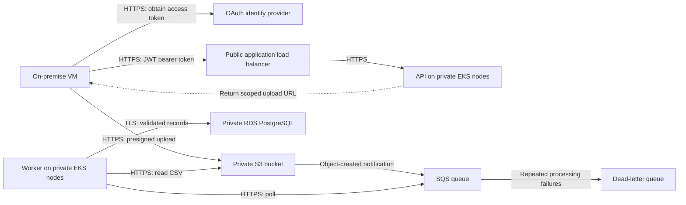

# Task 1 — Hybrid integration architecture

Editable diagram: [Task 1 architecture (Draw.io)](task-1-architecture.drawio). Open it in Draw.io to view or edit.

## Scope and assumptions

Use AWS with an API microservice and batch worker on EKS in private subnets. Assume the on-premise VM can initiate outbound HTTPS (TCP 443), an organisation-managed OAuth identity provider supports client credentials, and policy permits authenticated public HTTPS endpoints. No inbound internet connection to on-premise is required. A scheduled uploader on the VM forwards completed CSV files; the cloud then picks them up from S3. File volumes and database schema must be confirmed before sizing.

## Mode A — Reference-data API

The VM obtains a short-lived JWT access token using OAuth client credentials, then calls the API through an internet-facing Application Load Balancer (ALB). The API validates the token signature against the identity provider's trusted keys, allowed algorithm, issuer, audience and expiry, and requires `reference:read`. ALB uses an ACM-managed server certificate and forwards over HTTPS to the API. ALB does not validate target certificates, so security groups restrict the backend path to ALB-to-API traffic; this provides encryption, not mutual TLS identity verification. Nodes have no public IPs. Restrict ALB ingress to the organisation's fixed egress IPs where available. Configure private-subnet egress for identity-provider key retrieval and AWS service access.

## Mode B — Nightly file ingestion

A scheduled uploader waits for the local CSV to be complete, requests an upload URL using the same OAuth flow with `batch:upload`, and uploads over HTTPS. The API generates a short-lived S3 presigned PUT URL for a server-selected key under that client's `incoming/` prefix. Treat the URL as a bearer credential: never log it. Enable S3 Block Public Access, versioning, default server-side encryption and a bucket policy denying non-TLS requests. A presigned URL is reusable until expiry; it is not a one-time token.

An object-created notification for `incoming/*.csv` goes to SQS. The worker polls the queue, reads the exact object version, checks schema, required fields and data types, and commits validated records to RDS over certificate-verified TLS. Reject invalid files with a recorded reason. Record a stable batch ID and enforce database uniqueness within the same transaction as the load, preventing duplicate imports on retries. Delete the SQS message only after a successful commit or a recorded validation rejection. Retry transient failures; exhausted retries go to a dead-letter queue for investigation.

## Access, operations and trade-offs

Store the VM's OAuth secret in the existing on-premise secret store, restrict it to the uploader/application identity and rotate it. Give API and worker separate EKS workload IAM roles: the API can sign uploads only to the allowed prefix; the worker can consume its queue and read input versions. Permit S3 to publish only to the designated queue, restricted by source bucket ARN and account. Retrieve a restricted database user's credentials from Secrets Manager using the worker role; permit database connections only from the worker's allowed network path. AWS-managed keys encrypt S3 objects and SQS messages at rest.

Propagate a request ID for API calls and a batch ID from uploader through ingestion. Centralise structured logs without tokens or CSV contents. Alert on API errors/latency, missing nightly uploads, oldest queue-message age, rejected files and dead-letter messages; retain an ingestion status per batch.

Outbound HTTPS avoids VPN infrastructure and fits the no-inbound constraint, but exposes an authenticated cloud API endpoint. If policy mandates private connectivity, replace that path with Site-to-Site VPN and an internal ALB, and provide private access to S3. S3/SQS decouples transfer from processing and supports retries, at the cost of asynchronous completion and duplicate-delivery handling. Reuse EKS for the worker to fit existing operational skills. For this assignment, implement only the S3/SQS Terraform slice; EKS, ALB, the identity provider, application code and RDS remain design components.
